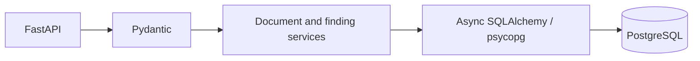

# ChainSecDB

**A provenance-first intelligence layer for blockchain security research.**

ChainSecDB is an open-source backend for building structured, verifiable datasets
from blockchain security research. It preserves original evidence so that future
findings, classifications, and research can be traced back to their sources.

**Today:** Phases 1A and 1B provide document ingestion, manually supplied security
findings, a small canonical taxonomy, and mechanically verified source evidence.
Original documents remain recoverable in PostgreSQL with SHA-256 deduplication.
Phase 1C adds extraction-run provenance, deterministic structured-output validation,
and an internal OpenAI provider. Extraction requires explicit local configuration
and invocation; HTTP endpoints do not trigger model calls.

**Direction:** connect audit findings, real-world exploits, root causes,
vulnerability taxonomies, security tooling, and protocol metadata into queryable
security intelligence. Automated extraction, cross-source correlation, and
AI-assisted research remain roadmap items; none are implemented yet.

## Why ChainSecDB?

Blockchain security knowledge is scattered across audit reports, competitive audit
findings, exploit postmortems, bug bounty disclosures, repositories, incident
databases, taxonomies, and reproducible exploit PoCs. Different sources often
describe the same underlying problems using different terminology and structures.

ChainSecDB aims to provide a common data layer with one durable rule:
**every derived record should be traceable to its original source.** Original
evidence remains the source of truth.

## What works today

- Store original UTF-8 security documents in PostgreSQL and retrieve them by UUID.
- Preserve text exactly, alongside source metadata and retrieval timestamps.
- Compute SHA-256 fingerprints server-side and reject duplicate content through
  a PostgreSQL uniqueness constraint, including concurrent submissions.
- Validate requests with Pydantic, bound request bodies, and sanitize errors.
- Manage schema changes with Alembic and test persistence against real PostgreSQL.
- Store manually supplied findings with source labels kept separate from canonical
  categories and normalized severity.
- Attach exact source excerpts to finding fields and verify their document offsets.
- Create findings with server-controlled `UNREVIEWED` verification status.

There is no AI extraction yet. The deterministic data layer comes first.

## Quick start

Requirements: **Python 3.12+**, **uv**, and **PostgreSQL**. Docker Compose supplies
PostgreSQL 16 for local development; it is optional if a database is already available.

```sh
git clone https://github.com/rootkit-io/ChainSecDB.git
cd ChainSecDB
uv sync --python 3.12
cp .env.example .env
docker compose up -d
uv run alembic upgrade head
uv run uvicorn app.main:app --reload
```

Using an existing PostgreSQL instance? Set `DATABASE_URL` in `.env` and skip
`docker compose up -d`. Run migrations before starting the application.

Interactive API documentation: <http://127.0.0.1:8000/docs>.

### Store a security document

```sh
curl -i -X POST http://127.0.0.1:8000/documents \
  -H 'Content-Type: application/json' \
  -d '{
    "source_name": "manual",
    "source_url": "https://example.com/security-report",
    "document_type": "audit_report",
    "raw_text": "Security report contents..."
  }'
```

Returns **201 Created** with the document UUID, source metadata, SHA-256 hash, and
timestamps. POST omits the raw body; GET returns it unchanged:

```sh
DOCUMENT_ID=replace-with-returned-uuid
curl "http://127.0.0.1:8000/documents/$DOCUMENT_ID"
```

Submitting identical text again returns **409 Conflict**, even if its source
metadata differs. See the [API contract](docs/api.md) for example responses,
validation rules, and errors.

### Add structured findings

`POST /documents/{document_id}/findings` creates a finding and its evidence
atomically. `GET /findings/{id}` retrieves it;
`GET /documents/{document_id}/findings` lists a document's findings.

Callers supply normalized severity and one of [20 canonical categories](docs/taxonomy.md),
while original source labels remain unchanged. Source excerpts must match the
document exactly; repeated excerpts require explicit offsets. See the
[finding API](docs/api.md#findings) for a complete example.

## Provenance first

Original evidence and derived interpretation have different roles. Future
classifications, summaries, normalized findings, and root-cause analyses must
reference their supporting source material. They must never replace it.

Current request path:



## Roadmap

| Phase | Focus | Status |
| --- | --- | --- |
| 1A | Raw documents, source metadata, SHA-256 deduplication, persistence | Implemented |
| 1B | Manual findings, source/canonical labels, exact evidence, verification status | Implemented |
| 1C.1 | Extraction-run provenance and deterministic output validation; no provider calls | Implemented |
| 1C.2 | Internal OpenAI extraction using exact evidence validation | Implemented |
| 1C.3 | Extraction evaluation and benchmarking | Planned |
| 2 | Incident intelligence linking findings, root causes, and real exploits | Planned |
| Later | Cross-source research, semantic discovery, protocol/tool/funding relationships, research agents | Exploratory |

See the [full roadmap](docs/roadmap.md) and [taxonomy direction](docs/taxonomy.md).
Future phases build on the provenance guarantees of the ingestion foundation.

## Design principles

- **Evidence over generated prose:** AI output must never become the source of truth.
- **Database constraints over assumptions:** enforce integrity in PostgreSQL where practical.
- **Deterministic before probabilistic:** code handles validation, transactions, and guarantees.
- **Preserve upstream information:** retain source taxonomies, severity labels, and original text.
- **Small, testable phases:** verify each foundation before introducing more automation.

## Explore the project

| Document | What it covers |
| --- | --- |
| [Architecture](docs/architecture.md) | Backend layout, lifecycle, configuration, development checks |
| [API](docs/api.md) | Requests, responses, validation, limits, status codes |
| [Database](docs/database.md) | Table, constraints, transactions, migrations |
| [Security](docs/security.md) | Trust boundaries, safe handling, current limitations |
| [Roadmap](docs/roadmap.md) | Phase goals and future research directions |
| [Taxonomy](docs/taxonomy.md) | Canonical categories, source-label preservation, normalization policy |

## Status and license

ChainSecDB is experimental and in early development. Today it is a research-data
foundation; it does not audit smart contracts or provide a production security service.

Licensed under [Apache-2.0](LICENSE).
