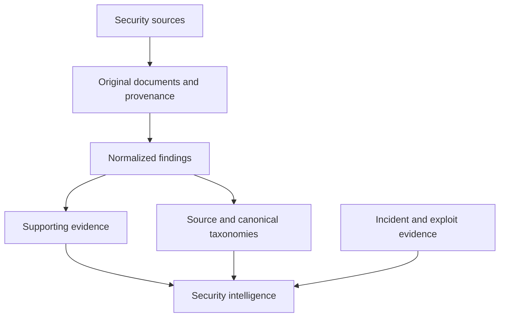

# Roadmap

[Project overview](../README.md) · [Taxonomy direction](taxonomy.md)

**Phases 1A, 1B, and 1C.1** are implemented. Subsequent phases are planned or exploratory.
Each phase should be independently scoped and verified before adding further
automation.

## Phase 1A — Document ingestion: implemented

- Store raw security documents with source metadata and retrieval timestamps.
- Preserve original UTF-8 text exactly.
- Calculate SHA-256 hashes server-side and enforce uniqueness in PostgreSQL.
- Retrieve documents by UUID.
- Validate input, bound request bodies, sanitize errors, and manage migrations.
- Verify persistence, constraints, and duplicate races against real PostgreSQL.

This is the provenance foundation for later interpretation.

## Phase 1B — Structured security findings: implemented

- Manually supplied normalized finding records referencing original documents.
- Preservation of upstream taxonomy and severity labels.
- Twenty canonical categories, explicitly assigned by the caller without automatic mapping.
- Field-level source evidence with exact, mechanically checked offsets.
- Server-controlled verification status, always `UNREVIEWED` at creation.
- Atomic creation, per-document source-ID deduplication, and provenance constraints.

The [taxonomy definitions](taxonomy.md) preserve upstream information independently
from normalization. There is no review workflow or automated classification.

## Phase 1C.1 — Extraction infrastructure: implemented

- Provider/model/prompt/schema provenance in historical extraction-run records.
- Internal `PENDING -> RUNNING -> SUCCEEDED | FAILED` lifecycle with locked transitions.
- Strict structured-output validation, required explicit evidence offsets, and bounded lists.
- Atomic persistence of accepted findings as `UNREVIEWED`, linked to their extraction run.
- Sanitized failed-run provenance and retry-by-new-run policy; no retry automation.

No provider is implemented and no LLM is called. This is a deterministic internal
foundation, not functioning AI extraction. Manual Phase 1B endpoints remain compatible.

## Phase 1C.2–1C.3 — Provider integration and evaluation: planned

- Structured, evidence-grounded LLM extraction.
- A real provider implementation using the versioned extraction-run boundary.
- Hallucination checks and explicit uncertainty.
- Evaluation against human-reviewed findings.

Generated classifications, summaries, and findings must never replace source
material. Deterministic code remains responsible for validation and integrity.

## Phase 2 — Incident intelligence: planned

Potential sources include exploit databases, root-cause reports, reproducible
exploit PoCs, and historical protocol incidents. The objective is to connect audit
findings, root causes, and real exploits while preserving evidence for each link.

The incident and correlation portions describe future direction. Current document,
finding, taxonomy, and evidence behavior is documented in the [API](api.md).
Connectors for Solodit, audit repositories, exploit collections, and incident
registries are not implemented or committed to a specific integration phase.

## Later research directions: exploratory

- Cross-source vulnerability normalization and exploit/finding correlation.
- Security pattern discovery and semantic research.
- Protocol security intelligence.
- Relationships between funding, companies, protocols, and security tooling.
- Research agents built on verified data.

These are research directions, not scheduled features. Queues, agent frameworks,
vector databases, and other infrastructure should be introduced only when a
concrete phase justifies them.
