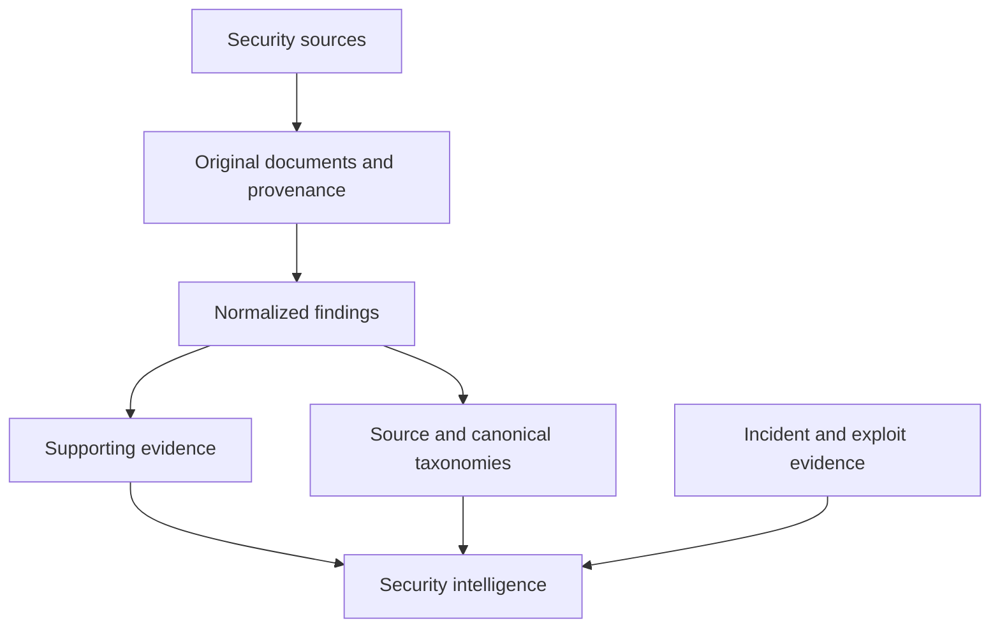

# Roadmap

[Project overview](../README.md) · [Taxonomy direction](taxonomy.md)

Only **Phase 1A** is implemented. Subsequent phases are planned or exploratory.
Each phase should be independently scoped and verified before adding further
automation.

## Phase 1A — Document ingestion: implemented

- Store raw security documents with source metadata and retrieval timestamps.
- Preserve original UTF-8 text exactly.
- Calculate SHA-256 hashes server-side and enforce uniqueness in PostgreSQL.
- Retrieve documents by UUID.
- Validate input, bound request bodies, sanitize errors, and manage migrations.
- Verify persistence, constraints, and duplicate races against real PostgreSQL.

This is the provenance foundation for later interpretation.

## Phase 1B — Structured security findings: planned

- Normalized finding records referencing original documents.
- Preservation of upstream taxonomy and severity labels.
- Canonical vulnerability taxonomy with explicit source-to-canonical mappings.
- Field-level supporting evidence.
- Human verification state.

The intended [taxonomy principles](taxonomy.md) preserve upstream information and
allow uncertainty. No canonical categories or schema have been chosen yet.

## Phase 1C — AI-assisted extraction: planned

- Structured, evidence-grounded LLM extraction.
- Prompt/model versioning and recorded extraction runs.
- Hallucination checks and explicit uncertainty.
- Evaluation against human-reviewed findings.

Generated classifications, summaries, and findings must never replace source
material. Deterministic code remains responsible for validation and integrity.

## Phase 2 — Incident intelligence: planned

Potential sources include exploit databases, root-cause reports, reproducible
exploit PoCs, and historical protocol incidents. The objective is to connect audit
findings, root causes, and real exploits while preserving evidence for each link.

This diagram describes future direction, not current backend capabilities.
Connectors for Solodit, audit repositories, exploit collections, and incident
registries are not implemented or committed to a specific integration phase.

## Later research directions: exploratory

- Cross-source vulnerability normalization and exploit/finding correlation.
- Security pattern discovery and semantic research.
- Protocol security intelligence.
- Relationships between funding, companies, protocols, and security tooling.
- Research agents built on verified data.

These are research directions, not scheduled features. Queues, agent frameworks,
vector databases, and other infrastructure should be introduced only when a
concrete phase justifies them.
